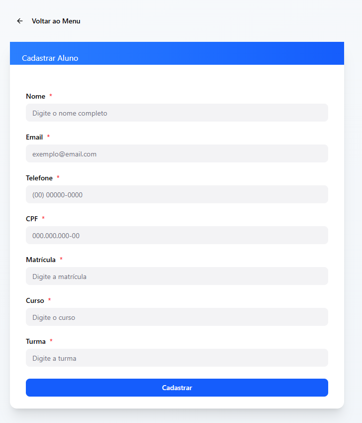
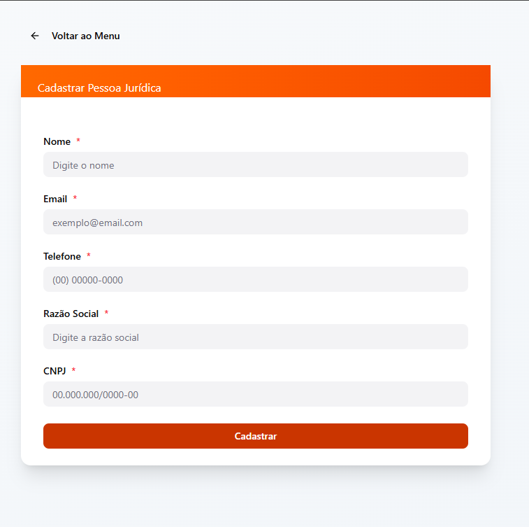
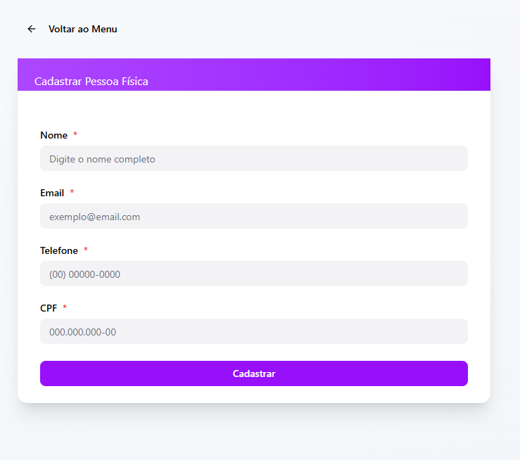
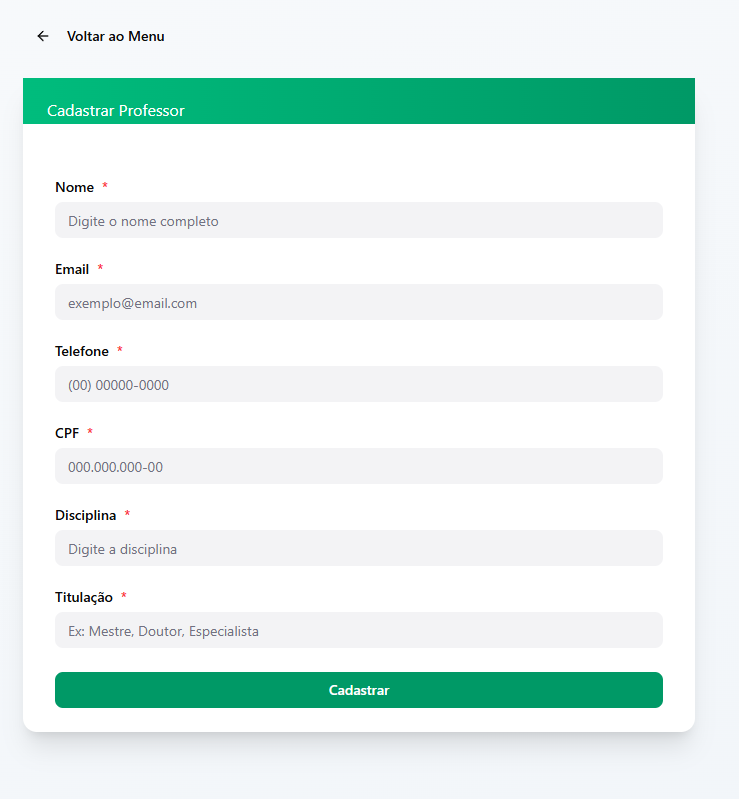
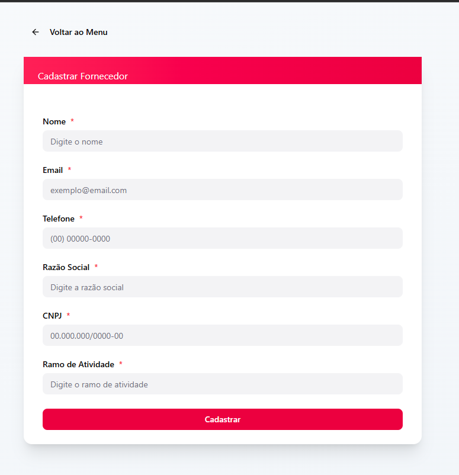
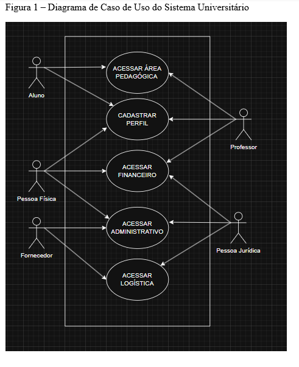
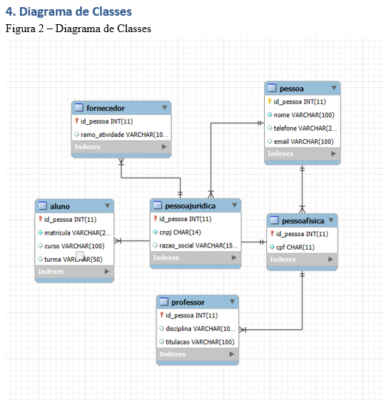
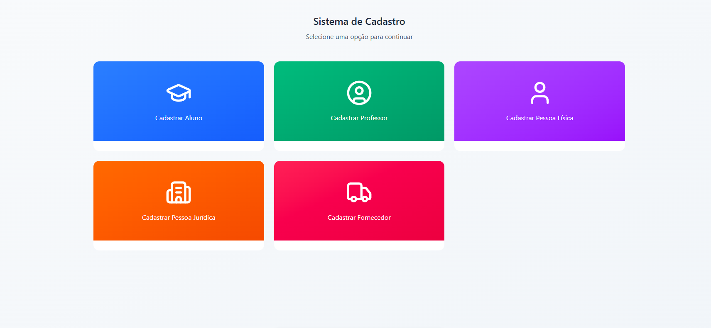

# 📚 Sistema de Gestão Escolar

Um projeto desenvolvido para facilitar o cadastramento e gerenciamento de informações essenciais em uma escola — desde alunos até professores, fornecedores e pessoas jurídicas.  
Este sistema nasceu para organizar o caos, transformar dados em clareza e dar ritmo à administração escolar.

---

## 🌟 Funcionalidades Principais

- Cadastro de Alunos  
- Cadastro de Professores  
- Cadastro de Pessoas Físicas  
- Cadastro de Pessoas Jurídicas  
- Cadastro de Fornecedores  

---

# 🖼️ Protótipos das Telas

A seguir estão os protótipos oficiais utilizados na concepção do sistema.  
As imagens devem estar presentes no diretório:
---

## 🧑‍🎓 Cadastro de Aluno  

---

## 🧾 Cadastro de Pessoa Jurídica  

---

## 🧍 Cadastro de Pessoa Física  

---

## 👨‍🏫 Cadastro de Professor  

---

## 🚚 Cadastro de Fornecedor  

---

# 🛠️ Tecnologias Previstas

- **HTML5 e CSS3**  
- **JavaScript (ES6+)**  
- **PHP Orientado a Objetos**  
- **MySQL**  
- **Arquitetura inspirada no padrão MVC**  
- **Fetch API para requisições assíncronas**

---

# 🌱 Objetivo do Projeto

Criar um ambiente digital simples, intuitivo e robusto para a gestão escolar, permitindo que cada ator — aluno, professor, fornecedor — seja registrado com precisão.  
O sistema busca trazer organização, clareza e um toque de poesia ao mundo administrativo da educação.

---

# 📘 Diagramas do Sistema

## 📌 Diagrama de Caso de Uso  

---

## 📌 Diagrama de Classes  

---

## 🌐 Visão Geral do Sistema  

# 🎨 Protótipo no Figma

Você pode visualizar o protótipo completo diretamente no Figma através do link abaixo:

👉 [Acessar protótipo no Figma](figma.com/make/w9Bw29DyJa7oIkDysP6W3g/Sistema-de-Cadastro-Acadêmico?t=wCXSNIYxIKTGWRJb&fullscreen=1)

# 🗃️ Arquivos SQL do Projeto

Os scripts utilizados para criação da estrutura do banco e para consultas estão disponíveis abaixo:

- 📄 [create_tables.sql](imagens/create_tables.sql) — Estrutura completa do banco Universidade  
- 📄 [queries.sql](imagens/queries.sql) — Consultas úteis, inserts e relatórios SQL
